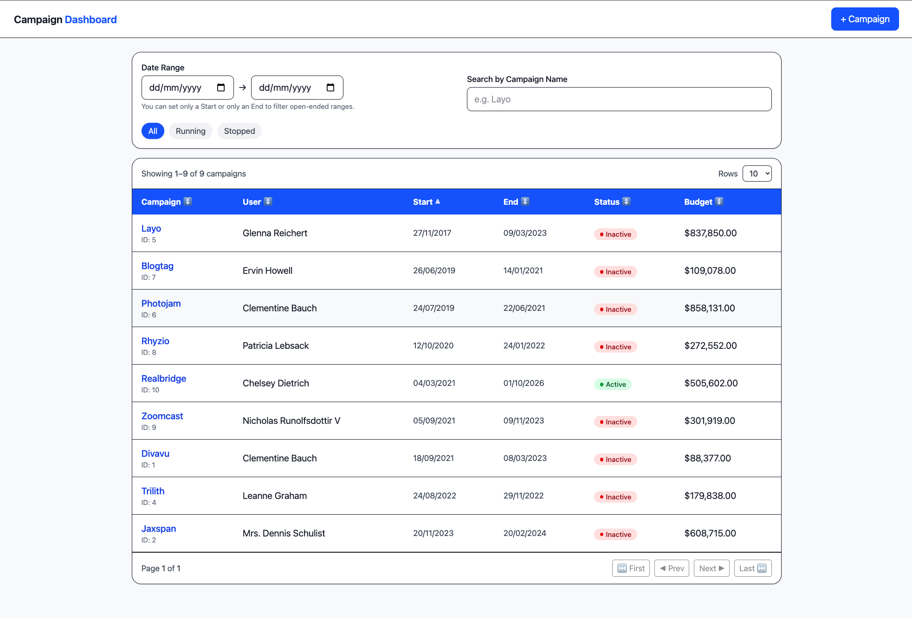
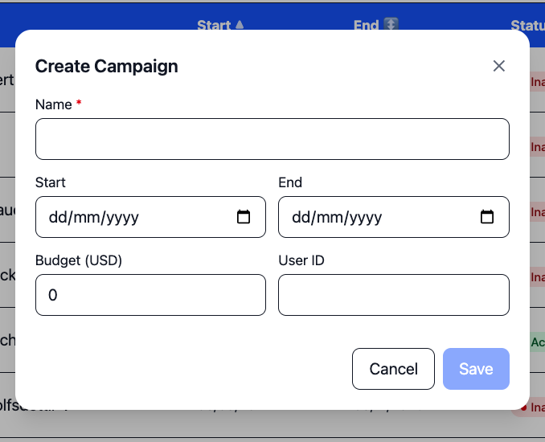

Here’s a **complete README.md** draft for your app, structured and copy-paste ready 👇

---

````md
# 📊 Campaign Management Application

A robust, production-ready **React + Redux Toolkit** application for managing campaigns.  
It includes advanced filtering, sorting, validation, and unit tests to ensure reliability.

---

## 🚀 Live Demo

🔗 [Live Server](https://your-live-server-link.com)  
💻 [GitHub Repository](https://github.com/your-username/campaign-management)

---

## ⚙️ Installation & Setup

1. **Clone the repo**
   ```bash
   git clone https://github.com/your-username/campaign-management.git
   cd campaign-management
   ```
````

2. **Install dependencies**

   ```bash
   npm install

   ```

3. **Run development server**

   ```bash
   npm run dev

   ```

4. **Run tests**

   ```bash
   npm test
   ```

5. **Build for production**

   ```bash
   npm run build
   ```

---

## ✨ Features

### 📅 Date Range Search

- **Start Date only:** Shows campaigns whose start date is **equal to or greater than** the selected date.
- **End Date only:** Shows campaigns whose end date is **less than or equal to** the selected date.
- **Start + End Date:** Shows campaigns falling **within the selected range**.

### 🎛 Campaign Status Filters

- Toggle between **All**, **Running**, or **Stopped** campaigns.

### 🔍 Search

- **Search by campaign name** (case-insensitive).

### ↕️ Sorting

- Sort campaigns by **any field** in the table (e.g., name, start date, end date, budget).

### 📄 Pagination

- View total **number of rows**.
- Navigate results with **pagination controls**.

### ➕ Add Campaign

- Dedicated **Add Campaign** button & dialog.
- **Campaign Name is mandatory**.
- **Budget input prevents negative values** with validation.

### 🌍 Global Method: `AddCampaigns`

- Exposes a global method `AddCampaigns(campaignArray)` to dynamically render campaigns.

### 🗂 State Management

- Built with **Redux Toolkit** + **Thunk** for async data fetching.

### ✅ Unit Tests

- Comprehensive test suite using **Vitest** & **React Testing Library**.
- Covers reducers, thunks, and components.

### 🛡 Production-Ready Practices

- Robust **form validations**.
- User-friendly **error handling**.
- Smooth **loading states with shimmer UI** for a better UX.

---

## 🏗 Tech Stack

- **React 18**
- **Redux Toolkit** (with Thunk)
- **TypeScript**
- **TailwindCSS** (styling)
- **Vitest** + **React Testing Library** (testing)

---

## 📸 Screenshots

### Campaign Dashboard



### Add Campaign Dialog



---

```

```
